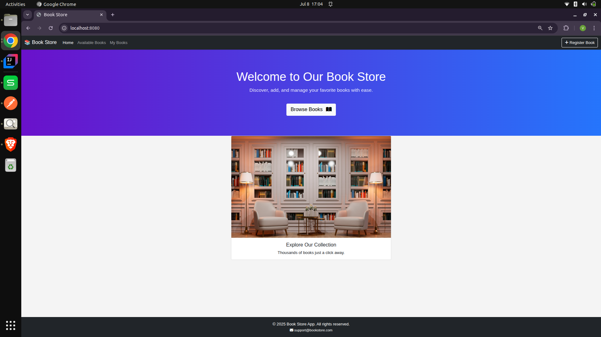
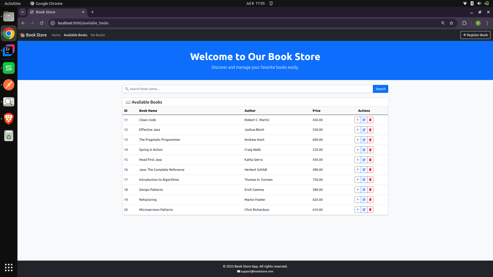
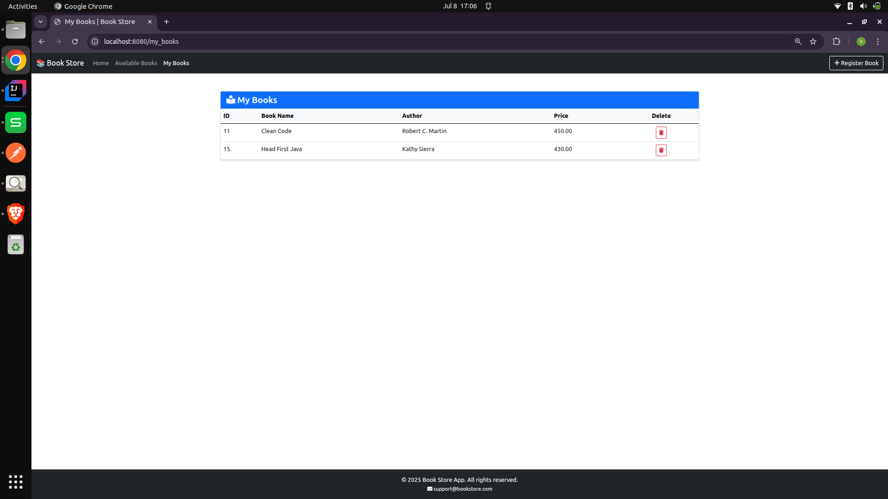
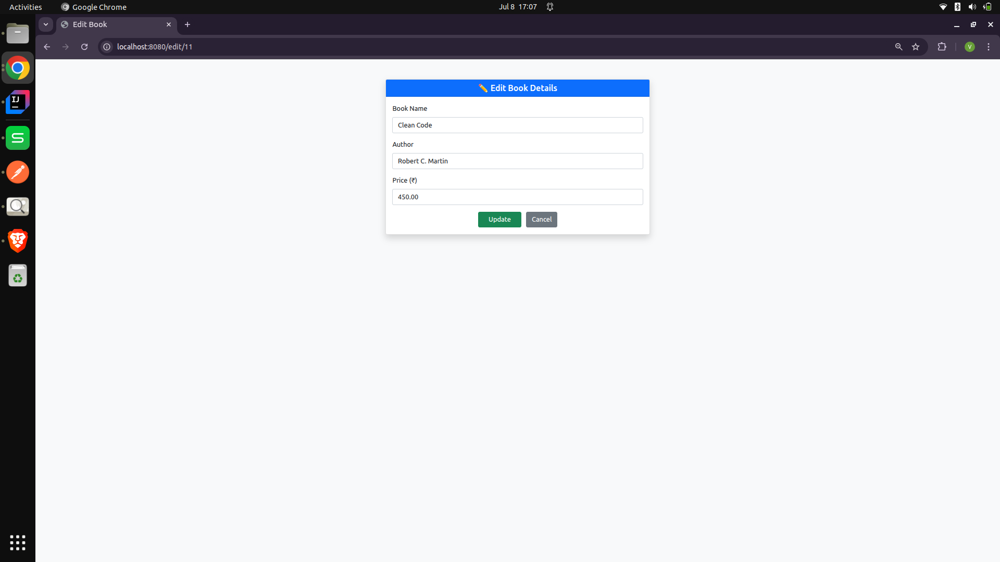
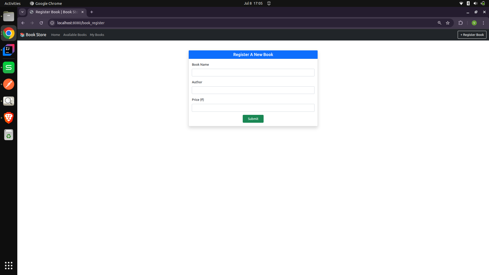

# 📚 Book Store Management System

A full-stack web application built using **Java**, **Spring Boot**, **JPA**, and **MySQL** that allows users to manage a collection of books with a user-friendly UI powered by **Bootstrap** and **Thymeleaf**.

---

## ✨ Features

- 📖 Register and display books in the **Available Books** section  
- ➕ Add books to **My Books**  
- ❌ Remove books from **My Books**  
- ✏️ Edit and update book details  
- 🔍 Search books by title  
- 🗃️ Data persistence using Spring Data JPA and MySQL

---

## 🛠️ Tech Stack

- **Java 17+**
- **Spring Boot**
- **Spring Data JPA**
- **MySQL**
- **Thymeleaf**
- **Bootstrap 5**
- **HTML/CSS**

---

## 🧩 Project Structure

src/
├── main/
│ ├── java/
│ │ └── com/example/bookstore/
│ │ ├── controller/
│ │ ├── model/
│ │ ├── repository/
│ │ └── service/
│ └── resources/
│ ├── templates/
│ ├── static/
│ └── application.properties

yaml
Copy
Edit

---

## 🚀 Getting Started

### 1. Clone the Repository
```bash
git clone https://github.com/Jeetrajput001/book_store.git
cd book_store
2. Configure MySQL Database
In src/main/resources/application.properties:

properties
Copy
Edit
spring.datasource.url=jdbc:mysql://localhost:3306/bookstore_db
spring.datasource.username=your_mysql_username
spring.datasource.password=your_mysql_password
spring.jpa.hibernate.ddl-auto=update
3. Run the Application
bash
Copy
Edit
./mvnw spring-boot:run
Or run the BookStoreApplication class from your IDE.
___

```
### 📸 Screenshots

Home Page



Available Books page & Search functionality



My Books page



Edit functionality Page



Add Book Page



🧠 How It Works
Book data is stored in a MySQL database

Backend services use Spring Boot and JPA for CRUD operations

Frontend is built with Thymeleaf templates styled using Bootstrap

Data flows through Controller → Service → Repository layers

Search functionality filters books by title dynamically

📬 Contact
Made with ❤️ by Vishwajeet Singh

📧 Email: vishwjeetsingh83@gmail.com

🔗 LinkedIn: https://www.linkedin.com/in/vishwajeet-singh-844b5622a?utm_source=share&utm_campaign=share_via&utm_content=profile&utm_medium=ios_app

🌐 GitHub: github.com/Jeetrajput001

“Built for clean code, intuitive UX, and real-world learning.”

